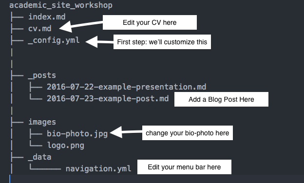

## What is GitHub Pages?

GitHub Pages is a system built into GitHub that allows you to build websites directly from a GitHub Repository.

There are two kinds of GitHub pages:

+ Personal websites (associated with an account)
+ Repository Specific Websites (webpages for software or projects)

We'll mostly cover the personal website for today.

## Why GitHub Pages?

GitHub is a highly dependable webhost, and you get one personal webpage account for free.  Plus, if you move institutions, your website can travel with you.

Because GitHub pages is compatible with Markdown, we'll be using Markdown formatting to build our webpage.

## Our goal for the day

We're going to build a personal webpage which will live at USERNAME.github.io.  The template we're using, Jekyll Academic, was developed by [NCSU Libraries](https://www.lib.ncsu.edu/) and is tailored specifically for use within the academic community.  

There is a live example of the template here: https://laderast.github.io/academic_site_workshop/.  You'll be able to customize many elements, including the color scheme.

## What You Need for Today

You don't need to know how to code or know HTML to setup a GitHub Page. We'll learn some Markdown basics so that we can add content to our site. Here's what you need.

+ A Laptop
+ [A GitHub Account](https://github.com/join)

Additionally, it will be helpful to have the following on hand so you can add content to your new website:

+ A short bio
+ A headshot or another image that represents your professional interests
+ A C.V. or resume

You may want to spend a little time learning how to use markdown, as it'll make putting your content together faster. There is a tutorial here: [The Magic of Markdown](https://laderast.github.io/magic-of-markdown/) that will get you started with the basics. We'll give you just enough to get started.

## What We're Going to do Today

  1. Fork the repository
  1. Rename the repository
  1. Change and personalize your website with YAML
  1. Look at your new website!
  1. Start editing content with Markdown
  1. Add links
  1. Add images
  1. Add a blog post
  1. Customize your menu bar with new links
  1. Look at your even better website!
  1. Make a local copy for easier editing

## Fork the Repo(sitory) From GitHub

Log into your GitHub account. Now go to the website repo: https://github.com/laderast/academic_site_workshop and click the "Fork" button on the top right of the webpage.

When we fork we're copying the files into our own repository.  We'll use the copy as the building block for your new website. 

## A little bit about Jekyll

Jekyll is what's known as a static site generator. It will build a website from simple text files that are in Markdown. Markdown is much easier to work with, since you don't have to worry about adding HTML tags and accidentally breaking it.

The other nice thing about Jekyll is that it will integrate things like Google Analytics, Tags, and search into your website structure.

Jekyll is built into GitHub, so we just need to edit the files in our repository to have GitHub automatically build the webpage.

Here's a little picture of the file structure of our website and what we'll do to modify it.



## Rename the Repo

Now click the "Settings" tab on your repository. Change your repository name to USERNAME.github.io, where USERNAME is your GitHub Login.

## Editing the Name of Your Webpage and Customizing

The first step to creating your website is to edit the information in the YAML file.  This is a simple configuration file where some important settings for your site are stored. 

You'll find the `_config.yml` file in the root (parent) level of your repo. In GitHub, click on the `_config.yml` file.  To edit it click on the pencil button on the right.

Update the *title*, *name*, *bio*, *email*, and the social media fields (such as *twitter*, *linkedin*) with your information.

Just make you that you don't modify anything below `#DO NOT EDIT BEYOND THIS POINT`.

Here's an example `_config.yml` file. Don't worry about the avatar and the logo file for right now. # symbols are the beginning of comments.  The text to the right of the # symbol is ignored.  

```
# Site wide configuration

title: Academic Website of Ted Laderas
locale: en_US
logo: # filename of a logo image that has been placed into your images directory

# Enter the following platform usernames if you would like for them to appear on your site.
owner:
  name: Ted Laderas
  avatar: bio-photo.jpg
  bio: "This is a sample Jekyll academic website."
  email: laderast@ohsu.edu
  # Do not include the @ symbol in your Twitter username
  twitter: laderast
  linkedin: #username
  github: laderast
  orcid: # ID Number (ex. 0000-0000-0000-0000)
  researchgate: #username
  mendeley: #username
  google:
    plus: #username
    analytics:
    verify:
    scholar: #id
```

After you have edited your `_config.yml` file, click the green "Commit changes" button at the bottom of the page, which will save the file to your repository.

## Look at your new website!

You're ready to go! Now check out your initialized website at https://USERNAME.github.io. Next we'll start customizing it!

## Make Content Using Markdown

We'll be adding our content by using Markdown Files. Markdown is a lightweight way to format text that is much easier to manipulate than working with HTML files directly.

GitHub has a "translation engine" that will transform and format your Markdown files for the website, making them browser friendly.

This means you can concentrate on making content rather than obsessing about every little site detail!

## Markdown Basics

A markdown file generally has a `.md` or a `.markdown` extension.  It uses plain text formatting syntax, which is pretty easy to learn.  For example, bulleted lists are denoted with an asterix before each line item and subheadings with one or more hash marks.  

This markdown cheatsheet is handy to learn how to do things. https://enterprise.github.com/downloads/en/markdown-cheatsheet.pdf

Way more info about writing markdown can be found here: https://github.com/laderast/magic-of-markdown

Try editing the `cv.md` file with your info (remember to click the edit pencil button). When you're done, click the green "Commit changes" button at the bottom to save your changes.

Reload your website to make sure that the changes worked. It sometimes takes a little time for GitHub to update the files, so be patient if they don't appear immediately.

## Let's Update Your Home Page (Index) And Add Some Links

Your `index.md` file controls your website's front matter.  You'll want to update it with your short bio and links to relevent projects and interests.  For example, take a look at [Robin's website](https://rchampieux.github.io/).

Her bio and project list links out to other websites.  It's easy to do this in markdown.  Add a link by enclosing the text for your link in square brackets (`[text here]`) and the underlying link in parentheses (`(http://link-here.com)`) right next to it (no spaces). So altogether, it should look like this:

```
[link to Google](https://www.google.com)
```

Try updating your bio and adding some links to your `index.md` file, such as recently published paper or Github repo. Click the "Commit Your Changes" button when you're done.

## Let's Add an Image (from an external website)

You can also add images to your webpage. GitHub has a mascot called Octocat, so let's add a picture of Octocat to our site. Doing this is very similar to adding a link, you just need to add an exclamation mark in front of the square bracket and parentheses. Try adding a picture to your `cv.md` file!

An example looks like this

```

```
The output looks like this:


**Note**: The text within the square brackets should be a description of the image.  Providing this is good practice, and facilitates compliance with accessibility technologies (such as screen readers), but you can leave it blank and the following would also work.

```

```

## Uploading images to your website and using them

Where do you put images you've made? In the `images/` folder. Upload a photo of yourself to this folder (Click the "Upload Files" button), and make sure it is named `bio-photo.jpg`.

Now you can upload your headshot or another image into to that directory using the `Upload Files` button. Then you can refer to them in your website like this:

```

```

Now check out your website again.  The picture you uploaded should have replaced the generic image we started with.  Take another lookl at your `_config.yml` file to understand why.

## Add a Blog Entry

Your website is set up to publish blog entries. In your root folder, you'll find folder named `_posts`. This is where you'll put new blog posts. Open this folder and create a new file.

Each post you make should be in the form `YEAR-MONTH-DAY-title.md`, so for example, `2017-04-21-github-pages-tutorial.md`. You'll also want this `.yaml`-like text near the top.

```
---
layout: post
title: Awesome Blog Post
excerpt: "Why you should read my website"
tags: [intro, beginner, jekyll, tutorial]
comments: true
category: blog
---

Text for your post goes here.
```

This is a great opportunity to practice some Markdown!
### Such as headers

and **bolding**

* and lists

Note there's lots of fields you can change: `title`, `excerpt`, `tags`, and `category`. `category` is the most important field, since your posts can either be a `presentation` or a `blog` depending on this field.

When you're done, commit the file into GitHub and confirm that your new blog post is up. You can also delete the sample blog posts so they don't show up on your page.

## Modifying the Menu

If you take a look at the example site, https://laderast.github.io/academic_site_workshop/ , you'll notice a menu bar at the top. You'll see links to other pages on the site in the menu. We can add and remove these links and their respective pages fairly easily.

Looking at the files in your main directory (which are the contents from `academic_site_workshop/`), the menu is generated based on the files that end in `.md` (except `LICENSE.md` and `README.md`) and have a little YAML entry. If you take a look, you can see `index.md` and `cv.md`. Similarly named links should be in the menu.

To create a new static page that shows up in your menu bar, you need to have the following at the top of your .md file and just change the text for the title.

```
---
layout: page
title: Coursework
---

Text for your page goes here.
```

Try adding a `coursework.md` file in the main directory by pasting the text above and then writing some content, such as classes you've taken. You can add some bullets by using the `+` symbol like this:

```
+ Basket Weaving
+ Cooking
+ GitHub Class
```

Which will show up like this:

+ Basket Weaving
+ Cooking
+ GitHub Class

Then you'll have to edit the `_data/navigation.yml` file to add that menu item. Here's my `navigation.yml` file:

```
# Site navigation links
- title: Home
  url: /

- title: Presentations
  url: /presentations/

- title: CV
  url: /cv/

- title: Blog
  url: /blog/

- title: Workshops
  url: /workshops/
```
Add another `title`/`url` entry for coursework. We named our file `coursework.md`, so the `url` will be `/coursework/`. Make sure that you start out with `-`.

When you're done, commit and load your website again. Confirm that "Coursework" shows up in the menubar. Neat!

If you don't want your blog to show up, you can delete its `title`/`url` entry here.

## Look at your even better website!

Congratulations on making it this far! This is just the start of your adventures with GitHub Pages. Learn some more Markdown and change and add what you want from now on.

Have fun!

## Make a local copy using GitHub Desktop (optional)

At some point, you will want to make a local copy of your website. This can be handy when you have multiple documents to edit, since editing on the website can be a bit of a pain.

At the top level of your repo, click the "Clone and Download" button and select "Open in GitHub Desktop".

I like to have a code specific folder to store my code, such as "c:/code/" (windows) or "~/Code/" (Mac/Linux) so that it has a permanent place to stay. So create a folder that is somewhere permanent and save your repo into that folder. Your "code" folder should now have a local copy of your repo.

You can now make changes on your local machine. Edit the files in a text editor such as [Sublime Text](https://www.sublimetext.com) and save them.

To update local files you've changed and push them to your GitHub, you will need to create a commit. In GitHub Desktop, click on the changed files that you updated and want pushed to the site. You'll need to create a commit message (a short bit of text that describes the changes you've made). Then you can push the "Sync" button to update.

Keep in mind: if you changed and added files on the website version, you will need to sync your own local repository to see those changes there.

A handy video intro to GitHub Desktop: https://www.youtube.com/watch?v=kFix7UDJ7LA

For more info on using GitHub Desktop: https://help.github.com/desktop/guides/getting-started/

## More Things to Do with your GitHub Page

The following are things you might like to do to your website.

## Lots of ways to customize your site

Look at the `Readme.md` file in the root level of your repo for more tweaks to you can make to the appearance of your blog.

You'll have to modify some `.html` files to do these changes.

## Making folder links using an `index.md` file

You might be wondering how to generate links that work with a trailing slash. For example, http://laderast.github.io/DS4BS/

The first step is to create a folder with that name, in the top level folder. For example, I just created a folder called `DS4BS` in my `laderast.github.io` folder. Then I just created a file called `index.md` in that folder.

Be sure to add the correct YAML at the start of your `index.md` file:

```
---
layout: page
title: New Page
---
```

If you have a file named `index.md` in your folder, your link will be automatically translated and served as a webpage. For example, if you added a folder named "stuff", and put an `index.md` in the folder, the link USERNAME.github.io/stuff/ will open that `index.md` file.

## Using Custom Themes

You might not like the layout of your page (that's fine). You can transfer your markdown files into a different Jekyll Theme and use that as the basis for your website.

http://jekyllthemes.org

Many of these themes you can fork and make a website directly, much like this tutorial. Note that you'll have to copy over any files that you've changed (such as the `cv.md` files and your blog posts in the `_posts` folder) to get them to show up in your new theme.

Unfortunately, the themes are not like plugins. Which means you will have to cut and paste your content into the new forked repo. The GitHub Pages developers are trying to make this process more streamlined. The big issue is that the `_config.yml` files have different fields and options depending on the template.

## If you know HTML

The cool thing about markdown is that you can add HTML directly into markdown files and the HTML should integrate pretty seamlessly. This is great when you want to customize placement of things.

For example, maybe we want a smaller version of octocat. We can just add an `` tag to customize it, and change the `height` attribute.

```

```


## Useful Links

Here is where you can read more about customizing the `jekyll-academic` template that your site is based on:

https://ncsu-libraries.github.io/jekyll-academic-docs/

The website world is your oyster now that you've mastered GitHub Pages and Markdown.

+ GitHub Pages: https://pages.github.com
+ Jekyll Themes: http://jekyllthemes.org

Markdown is not only useful for GitHub Pages. One markdown document can be translated into PDFs, HTML Slides, Word Documents, and a bunch of other formats. We talk about some of the uses here: http://laderast.github.io/magic-of-markdown/

## Cheatsheet

The ordered shortlist/cheatsheet for today's workshop:

+ Fork and rename the repo
+ Edit `_config.yml`
+ Update `cv.md`
+ Add links to `index.md`
+ Add an "external" image
+ Upload new bio photo `images/bio-photo.jpg`
+ Add blog post
+ Add a new menu option:
  + Write `coursework.md`
  + Update `_data/navigation.yml`
+ Clone to Desktop
