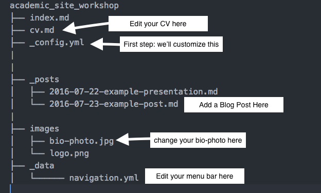

## What is GitHub Pages?

GitHub Pages is a system built into GitHub that allows you to build websites directly from a GitHub Repository.

There are two kinds of GitHub pages:

+ Personal websites (associated with an account)
+ Repository Specific Websites (webpages for software or projects)

We'll mostly cover the personal website for today.

## Why GitHub Pages?

GitHub is a highly dependable webhost, and you get one personal webpage account for free. 

Because GitHub pages is compatible with Markdown, we'll be using Markdown formatting to build our webpage.

## Our goal for the day

We're going to build a personal webpage which will live at USERNAME.github.io, and have blogging features and will be easily customizable. 

There's an example of a blog here: https://biodata-club.github.io/githubPagesTutorial/

## What You Need for Today

You don't need to know how to code or know HTML to setup a GitHub page. We'll learn some Markdown basics so that we can add content to our site. Here's what you need.

+ A Laptop
+ [A GitHub Account](https://github.com/join)
+ Something to say
+ Pictures (optional)

You may want to spend a little time learning how to use markdown, as it'll make putting your content together faster. There is a tutorial here: [The Magic of Markdown](https://laderast.github.io/magic-of-markdown/) that will get you started with the basics. We'll give you enough 

## What We're Going to do Today

  1. Fork the Repository
  1. Rename the Repo(sitory)
  1. Change and Personalize Your Site with YAML
  1. Look at your pretty website!
  1. Start Editing Content with Markdown 
  1. Adding Links
  1. Adding Images
  1. Add a Blog Post
  1. Customize your menubar with new links
  1. Look at your pretty website!
  1. Make a local copy for easier editing

## 1. Fork the Repo(istory) From GitHub

Log into your GitHub account. Now go to the website repo: https://github.com/laderast/academic_site_workshop and click the "Fork" button on the top right of the webpage.

When we fork, we're basically copying the files into our own version of the repository. Basically we'll use the above link as the basis of our website.

## A little bit about Jekyll

Jekyll is what's known as a static site generator. It will build a website from simpler text files that are in Markdown. Markdown is much easier to work with, since you don't have to worry about adding HTML tags and accidently breaking it. 

The other nice thing about Jekyll is that it will integrate things like Google Analytics, Tags, and search into your website structure.

Jekyll is built into GitHub, so we just need to edit the files in our repository to have it automatically build it.

Here's a little picture of the file structure of our website and what we'll do to modify it.



## 2. Rename the Repo

Now click the "Settings" tab on your repository. Change your repository name to USERNAME.github.io, where USERNAME is your GitHub Login.

## 3. Editing the Name of Your Webpage and Customizing

The first step to customizing your webpage is to edit the blog's name to include your information. To do this, you will be editing a YAML file, which is a simple configuration file. You'll open the `_config.yml` file in the root level of your repo to update the info here. In GitHub, click on the `_config.yml` file, and then edit it (it's the pencil button on the right). 

Change the *title*, *name*, *bio*, *email*, and the social media fields (such as *twitter*, *linkedin*) with your information.

Just make you that you don't modify anything below `#DO NOT EDIT BEYOND THIS POINT`.

Here's an example `_config.yml` file. Don't worry about the avatar and the logo file for right now.

```
# Site wide configuration

title: Academic Website of Ted Laderas
locale: en_US
logo: # filename of a logo image that has been placed into your images directory

# Enter the following platform usernames if you would like for them to appear on your site.
owner:
  name: Ted Laderas
  avatar: bio-photo.jpg
  bio: "This is a sample Jekyll academic website."
  email: laderast@ohsu.edu
  # Do not include the @ symbol in your Twitter username
  twitter: laderast
  linkedin: #username
  github: laderast
  orcid: # ID Number (ex. 0000-0000-0000-0000)
  researchgate: #username
  mendeley: #username
  google:
    plus: #username
    analytics:
    verify:
    scholar: #id
```

After you have edited your `_config.yml` file, click the green "Commit your changes" button at the bottom of the page. That will save the file to your repository.

## 4. Check out your Basic Website

You're ready to go! Now check out your initialized website at https://USERNAME.github.io. We'll start customizing it!

## 3. Check out your Basic Website

You're ready to go! Now check out your initialized website at https://USERNAME.github.io. We'll start customizing it!

## 5a. Make content using Markdown 

We'll be adding our content by using Markdown Files. Markdown is a lightweight way to format text that is much easier to manipulate than working with HTML files directly.

GitHub has a "translation engine" that will transform and format your Markdown files for the website to make them browser-friendly. 

This means you can concentrate on making content rather than obsessing about every little site detail. There are lots of designers who are good at that if you aren't.

## 5b. Markdown Basics

A markdown file generally has an `.md` or a `.markdown` extension. Let's open the file in `_posts/2012-02-07-example-content.md` in GitHub and you'll see some examples of how to write in markdown.

Way more info about writing markdown can be found here: https://github.com/laderast/magic-of-markdown

And this markdown cheatsheet is always handy if you forget how to do things. https://enterprise.github.com/downloads/en/markdown-cheatsheet.pdf

Try changing the `cv.md` file with your info (remember to click the edit pencil button). When you're done, click the green "commit your changes" button at the bottom to save your changes.

Reload your website to make sure that the changes worked. It sometimes takes a little time for GitHub to update the files, so be patient if they don't appear immediately.

## 6. Let's Add Some Links

Links, or URLs and web addresses, on a website can link to other webpages.

In your `index.md` file, you can add a link by enclosing the text for your link in square brackets (`[text here]`) and the underlying link in parentheses (`(http://link-here.com)`) right next to it. So altogether, it should look like this: 

```
[link to Google](https://www.google.com)
```

The output looks like this: [link to Google](https://www.google.com)

If you just want to show the link, you can paste it as is into your file.

```
https://www.google.com
```

https://www.google.com

Try adding some links to your `index.md` file, such as to your GitHub or Twitter accounts. Click the "Commit Your Changes" button when you're done.

## 7a. Let's Add an Image (from an external website)

You can also add images to your webpage. GitHub has a mascot called Octocat, so let's add a picture of Octocat to our site. Doing this is very similar to adding a link, you just need to add an exclamation mark in front of the square bracket and parentheses. Try adding a picture to your `cv.md` or your `about.md` files!

An example looks like this 

```

```
The output looks like this: 


**Note**: The text within the square brackets should be a description of the image.  Providing this is good practice, and facilitates compliance with accessibility technologies (such as screen readers), but you can leave it blank and the following would also work.

```

```

## 7b. Uploading images to your website and using them

Where do you put images you've made? In the `images/` folder. Upload a photo of yourself to this folder (Click the "Upload Files" button), and make sure it is named `bio-photo.jpg`. 

Now you can upload images into to that directory using the `Upload Files` button. Then you can refer to them in your website like this:

```

```

## 8. Add a Blog Entry

Your current repository is set up for blog entries. In your root folder, you'll find another folder named `_posts`. This is where you'll put new blog posts. Open this folder and create a new file.

Each post you make should be in the form `YEAR-MONTH-DAY-title.md`, so for example, `2017-04-21-github-pages-tutorial.md`. You'll also want a `.yaml`-like text near the top.

```
---
layout: blog
title: Awesome Blog Post
excerpt: "Why you should read my website"
tags: [intro, beginner, jekyll, tutorial]
comments: true
category: blog
---

Text for your post goes here.
```

This is a great opportunity to practice some Markdown!
### Such as headers

and **bolding**
* lists 

Note there's lots of fields you can change: `title`, `excerpt`, `tags`, and `category`. `category` is the most important field, since your posts can either be a `presentation` or a `blog` depending on this field. 

When you're done, commit the file into GitHub and confirm that your new blog post is up. You can also delete the sample blog posts so they don't show up on your page.

## 9. Modifying the Menu

If you take a look at the example site, https://biodata-club.github.io/githubPagesTutorial/, you'll notice a menu side bar on the left. Near the bottom left corner, you'll see links to other pages on the site. We can add and remove these links and their respective pages fairly easily.

Looking at the files in your main directory (which are the contents from `websiteFiles/`), the menu is automatically generated based on the files that end in `.md` (except `LICENSE.md` and `README.md`) and have a little YAML entry. If you take a look, you can see `about.md` and `cv.md`. Similarly named links should be in the menu.

To create a new static page that shows up in your sidebar, you need to have the following at the top and just change the text for the title.

```
---
layout: page
title: Coursework
---

Text for your page goes here.
```

Try adding a `coursework.md` file in the main directory by pasting the text above and then writing some content, such as classes you've taken. You can add some bullets by using the `+` symbol like this:

```
+ Basket Weaving
+ Cooking
+ GitHub Class
```

Which will show up like this:

+ Basket Weaving
+ Cooking
+ GitHub Class

Then you'll have to edit the `_data/navigation.yml` file to add that menu item. Here's my `navigation.yml` file:

```
# Site navigation links
- title: Home
  url: /

- title: Presentations
  url: /presentations/

- title: CV
  url: /cv/

- title: Blog
  url: /blog/

- title: Workshops
  url: /workshops/
```
Add another `title`/`url` entry for coursework. We named our file `coursework.md`, so the `url` will be `/coursework/`. 

When you're done, commit and load your website again. Confirm that "Coursework" shows up in the menu sidebar. Neat!

If you don't want your blog to show up, you can delete its `title`/`url` entry here. 

## 10. Look at your pretty website!

Congratulations on making it this far! This is just the start of your adventures with GitHub Pages. Learn some more Markdown, and have fun adding blog pages.

Have fun! 

## 11. Make a local copy using GitHub Desktop (optional)

At some point, you will want to make a local copy of your website. This can be handy when you have multiple documents to edit, since editing on the website can be a bit of a pain.

At the top level of your repo, click the "Clone and Download" button and select "Open in GitHub Desktop".

I like to have a code specific folder to store my code, such as "c:/code/" (windows) or "~/Code/" (Mac/Linux) so that it has a permanent place to stay. So create a folder that is somewhere permanent and save your repo into that folder. Your "code" folder should now have a local copy of your repo.

You can now make changes on your local machine. Edit the files in a text editor such as [Sublime Text](https://www.sublimetext.com) and save them.

To update local files you've changed and push them to your GitHub, you will need to create a commit. In GitHub Desktop, click on the changed files that you updated and want pushed to the site. You'll need to create a commit message (a short bit of text that describes the changes you've made). Then you can push the "Sync" button to update.

Keep in mind: if you changed and added files on the website version, you will need to sync your own local repository to see those changes there.

A handy video intro to GitHub Desktop: https://www.youtube.com/watch?v=kFix7UDJ7LA

For more info on using GitHub Desktop: https://help.github.com/desktop/guides/getting-started/

## More Things to Do with your GitHub Page

The following are things you might like to do to your website.

## Lots of ways to customize your site

Look at the `Readme.md` file in the root level of your repo for more tweaks to you can make to the appearance of your blog. 

You'll have to modify some `.html` files to do these changes, but it should be pretty painless to do.

## Making folder links using a `Index.md` file

You might be wondering how to generate links that work with a trailing slash. For example, http://laderast.github.io/DS4BS/

The first step is to create a folder with that name, in the top level folder. For example, I just created a folder called `DS4BS` in my `laderast.github.io` folder. Then I just created a file called `index.md` in that folder.

Be sure to add the correct YAML at the start of your `index.md` file: 

```
---
layout: page
title: New Page
---
```

If you have a file named `index.md` in your folder, your link will be automatically translated and served as a webpage. For example, if you added a folder named "stuff", and put an `index.md` in the folder, the link USERNAME.github.io/stuff/ will open that `index.md` file.

## Using Custom Themes

You might not like the layout of your page (that's fine). You can transfer your markdown files into a different Jekyll Theme and use that as the basis for your website. 

http://jekyllthemes.org

Many of these themes you can directly fork and make a website directly, much like this tutorial. Note that you'll have to copy over any files that you've changed (such as the `cv.md` files and your blog posts in the `_posts` folder) to get them to show up in your new theme.

Unfortunately, the themes are not like plugins. Which means you will have to cut and paste your content into the new forked repo. They (the GitHub Pages people) are trying to make this process more streamlined. The big issue is that the `_config.yml` files have different fields and options depending on the template.

## If you know HTML

The cool thing about markdown is that you can add HTML directly into markdown files and the HTML should integrate pretty seamlessly. This is great when you want to customize placement of things.

For example, maybe we want a smaller version of octocat. We can just add an `` tag to customize it, and change the `height` attribute.

```

```


## Useful Links

The world is now your oyster now that you've mastered GitHub Pages and Markdown.

+ GitHub Pages: https://pages.github.com
+ Jekyll Themes: http://jekyllthemes.org

Markdown is not only useful for GitHub Pages. One markdown document can be translated into PDFs, HTML Slides, Word Documents, and a bunch of other formats. We talk about some of the uses here: http://laderast.github.io/magic-of-markdown/
